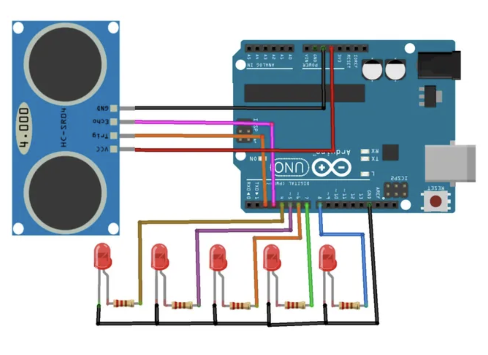

## Ultrasound based distanced detecting LED system

# What?
Arduino and ultrasound sensor based leds that change colors and blink based on the distance of an object. Can be used in parking places etc to visually indicate the closeness.

The repo has the arduino code and circuit diagram needed to do it yourself.

  1. Need to install arudino IDE.
  2. Connect the components as shown in the circuit diagram and plug the arduino to computer and select the board and upload the code

# Circuit Diagram

# Bill of Materials

The complete BOM is also available here:

[View BOM.csv](./bom.csv)

| Sl. No. | Component | Specification | Qty | Unit Price | Total |
|---:|---|---|---:|---:|---:|
| 1 | Arduino UNO | ATmega328P Development Board | 1 | 1550 | 1550 |
| 2 | HC-SR04 Ultrasonic Sensor | Ultrasonic Distance Sensor | 1 | 80 | 80 |
| 3 | LED | 5mm LED | 1 | 5 | 5 |
| 4 | 220Ω Resistor | 220 Ohm Resistor | 1 | 2 | 2 |
| 5 | Breadboard | Full Size Solderless Breadboard | 1 | 150 | 150 |
| 6 | Jumper Wires | Male-Male Dupont Wires | 1 | 100 | 100 |
| | | | | **Total** | **₹1887** (20 USD) |
