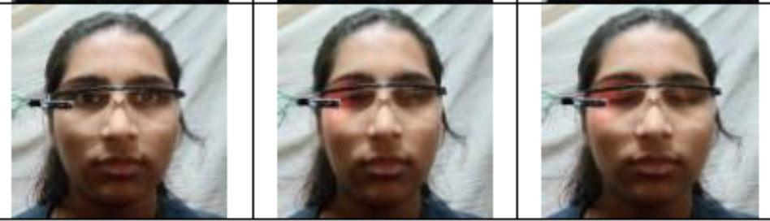
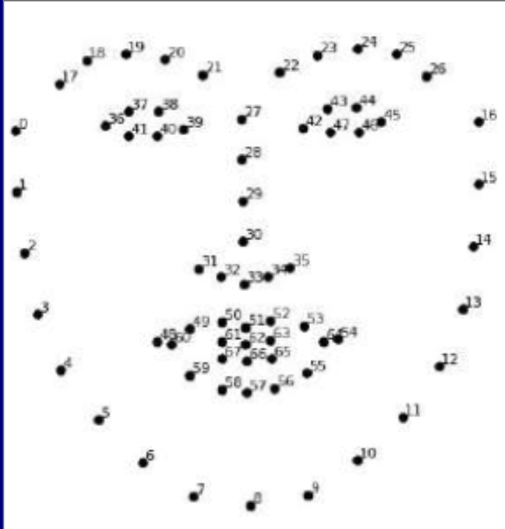
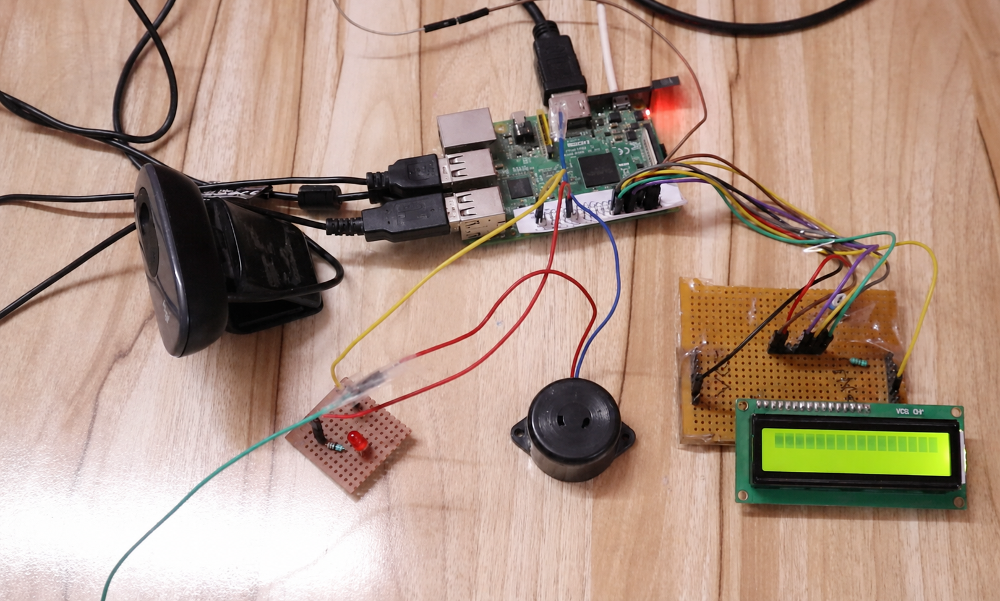
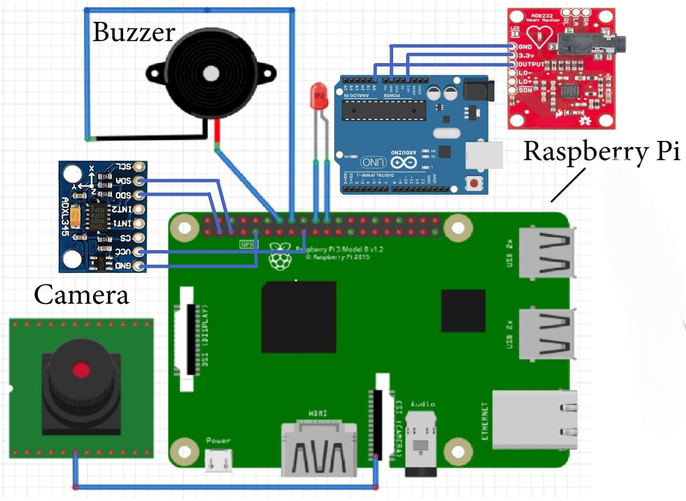
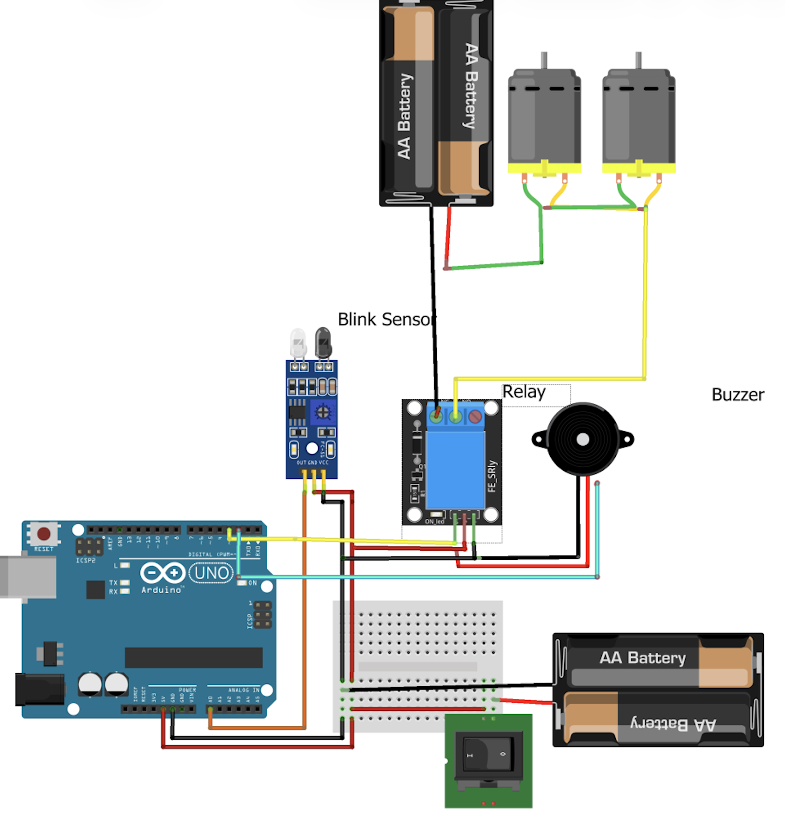

# Dual Driver Drowsiness Detection and Alert System
# What is this?

Sleepy driving is one of the major reasons for road accidents around the world. When a driver gets tired or starts falling asleep, their reaction time becomes slower and they can easily lose control of the vehicle. This is especially dangerous for bus and truck drivers who drive for many hours at night and on highways.

According to this research paper: https://doi.org/10.26719/emhj.22.055

Most normal safety systems like airbags are mainly useful **after an accident has already started or happened**. My idea with this project was to try and detect the problem **before the accident happens** by checking if the driver is getting sleepy.

This project is a made using:

- Raspberry Pi 5
- Raspberry Pi Camera Module 3
- OpenCV
- MediaPipe
- Computer Vision
- ESP32
- IR Eye Sensors
- Smart Wearable Glasses
- Buzzer and LEDs
- Wi-Fi

The project has two different ways of detecting drowsiness.

The first one uses a camera to look at the driver's face and eyes using computer vision.

The second one uses smart glasses with IR sensors to detect the driver's blinking and how long their eyes stay closed.

Both systems can be used separately or they can also be used together tho this would de redundant.

---

# Why did I make this?

I originally started this project because I was trying to learn how to make a **face recognition app**.

While I was working on that, I thought why not try making something that actually has some real world use. So I started looking into **drowsiness detection**.

At first I was just detecting drowsiness in front of my laptop using the webcam. It worked, but obviously there isn't much use in knowing that someone sitting in front of a laptop is sleepy.

So I decided to turn it into an actual **IoT project** using a Raspberry Pi and a camera.

The camera based system is pretty cool because it is **non intrusive and doesn't require the driver to wear anything**. The camera can just look at the driver and check their eyes.

But then I thought about the cost and complexity.

For this use case, the system doesn't necessarily need to be 100% accurate all the time. A few false alarms are okay if the main purpose is to warn the driver before they fall asleep.

So I thought of making a much cheaper approach using **wearable glasses with IR sensors**.

The glasses basically check the eyes and detect blinking. If the driver's eyes stay closed for longer than a certain threshold, the system assumes that the driver might be getting drowsy and gives an alert.

So I ended up making two approaches:

1. Camera + Computer Vision

2. Smart Glasses + IR Sensors

Both can be used together too, although it would be kind of redundant since both are trying to detect the same thing. Depending on the driver and situation, either one should be enough.

I think this could be quite useful for long distance interstate bus and truck drivers who drive for many hours, usually on highways and at high speeds.

Honestly, the better system is the smart glasses one because it works very well at night aswell, environment light conditions did not have any impact on the device when I tested this. While the OpenCV system did not work accurately under dark/very low light conditions.






[BOM](./bom.csv)
| Sl. No. | Component | Specification | Qty | Unit Price (₹) | Total (₹) |
|---:|---|---|---:|---:|---:|
| 1 | Raspberry Pi 5 (Wi-Fi) | 8 GB RAM | 1 | 24,000 | 24,000 |
| 2 | Raspberry Pi Camera Module 3 | 12 MP Sony IMX708, Autofocus | 1 | 4,000 | 4,000 |
| 3 | microSD Card | Class 10 / UHS-I | 1 | 900 | 900 |
| 4 | Raspberry Pi 5 Power Adapter | 5V 5A USB-C | 1 | 1,500 | 1,500 |
| 5 | ESP32 Development Board | Dual-Core Wi-Fi + Bluetooth | 1 | 900 | 900 |
| 6 | IR LED | 940 nm High Power | 2 | 50 | 100 |
| 7 | IR Sensor | High Sensitivity | 2 | 150 | 300 |
| 8 | Smart Glasses Frame | Lightweight Wearable Frame | 1 | 800 | 800 |
| 9 | 18650 Li-ion Battery | 3400 mAh | 1 | 600 | 600 |
| 10 | TP4056 Charging Module with Protection | USB-C | 1 | 200 | 200 |
| 11 | DC-DC Buck Converter | 3.3V/5V Adjustable | 1 | 250 | 250 |
| 12 | Active Piezo Buzzer | 5V | 1 | 150 | 150 |
| 13 | High Brightness LEDs | Red, Yellow, Green | 3 | 30 | 90 |
| 14 | Mini Speaker | 3W 4Ω | 1 | 500 | 500 |
| 15 | Breadboard | Full Size | 1 | 350 | 350 |
| 16 | Jumper Wire Kit | Premium Male-Male, Male-Female | 1 | 300 | 300 |
| 17 | Resistor Kit | Assorted | 1 | 200 | 200 |
| 18 | PCB, Headers & Connectors | JST, Berg Strips, Terminals | 1 | 600 | 600 |
| 19 | Acrylic Enclosure | Raspberry Pi Housing | 1 | 1,200 | 1,200 |
| 20 | Mounting Hardware | Screws, Nuts, Standoffs, Heat Shrink | 1 | 500 | 500 |
| 21 | USB-C Cable & Misc. Wiring | High Quality | 1 | 500 | 500 |
| | | | | **Total** | **₹37,940** |

# Report like Academic Description Below
---

Objectives

- Detect driver drowsiness in real time.
- Prevent accidents caused by driver fatigue.
- Implement two independent detection methods.
- Integrate Computer Vision and Wearable Sensor technologies.
- Establish Wi-Fi communication between wearable devices and Raspberry Pi.
- Generate instant audio and visual alerts.
- Log driver activity for future analysis.
- Build a scalable platform for future AI-assisted transportation systems.

---
System Architecture

```
                          Driver

                ┌─────────┴─────────┐
                │                   │

        Camera Monitoring      Smart Glasses

                │                   │

       OpenCV + MediaPipe      IR Eye Sensor

                │                   │

         Raspberry Pi 5 (Main Controller)

                │

        Decision Making Algorithm

                │

      ┌─────────┼─────────┐

   Buzzer      LED     Notifications

                │

          Data Logging

                │

     Cloud Dashboard (Future)
```

---

Hardware Components

Main Processing Unit

- Raspberry Pi 5 (8 GB Recommended)
- 32 GB MicroSD Card
- Raspberry Pi Power Supply

---

Vision-Based Detection

- Raspberry Pi Camera Module v3 or USB Webcam

Functions:
- Face Detection
- Eye Detection
- Facial Landmark Detection
- Blink Monitoring
- Eye Aspect Ratio (EAR) Calculation
- Yawning Detection
- Head Pose Estimation

---

Wearable Detection

- Smart Glasses Frame
- IR LED
- IR Receiver 
- ESP32 Wi-Fi Module
- Rechargeable Battery
- Voltage Regulator
- Power Switch

Functions:
- Eye Blink Detection
- Eye Closure Detection
- Blink Duration Measurement
- Wireless Data Transmission

---

Alert System
- Piezo Buzzer
- High Brightness LED
- Speaker (Optional)
  
---

Communication

- ESP32 Wi-Fi
- Raspberry Pi Wi-Fi
- Router or Mobile Hotspot

Supported Protocols

- MQTT
- HTTP REST API
- WebSocket

---

Software Requirements

Operating System

- Raspberry Pi OS

Programming Language

- Python 3

Libraries

- OpenCV
- MediaPipe
- NumPy
- SciPy
- Flask
- MQTT (Paho MQTT)

Development Tools

- VS Code
- Thonny IDE
- Git
- GitHub

---

Method 1 – Camera-Based Detection (OpenCV)



The camera continuously monitors the driver's face and extracts facial landmarks using MediaPipe or OpenCV. The Eye Aspect Ratio (EAR) is calculated from the detected eye landmarks to determine whether the driver's eyes are open or closed.

Workflow

```
Camera

↓

Capture Video

↓

Face Detection

↓

Facial Landmark Detection

↓

Eye Detection

↓

Calculate Eye Aspect Ratio (EAR)

↓

EAR > Threshold ?

├── Yes → Continue Monitoring

└── No

      ↓

Start Eye Closure Timer

      ↓

Eyes Closed > 2 Seconds ?

├── No → Continue Monitoring

└── Yes

      ↓

Driver Drowsy

      ↓

Activate Alarm

      ↓

Store Event Log

      ↓

Send Notification
```

Parameters Monitored

- Eye Aspect Ratio (EAR)
- Blink Rate
- Eye Closure Duration
- Face Orientation
- Yawning Detection (Optional)
- Head Tilt (Optional)

---

Method 2 – Smart Wearable Glasses



The wearable glasses use infrared sensors to monitor eye movements without requiring a camera. An IR LED emits infrared light toward the eye, while the IR receiver measures the reflected light intensity. The reflection changes depending on whether the eye is open or closed.


Workflow

```
IR LED

↓

Infrared Reflection

↓

IR Receiver

↓

ESP32

↓

Calculate Blink Duration

↓

Wi-Fi Transmission

↓

Raspberry Pi

↓

Analyze Eye Status

↓

Drowsiness Detected?

├── No → Continue Monitoring

└── Yes

      ↓

Activate Alarm

      ↓

Store Event Log
```

Parameters Monitored

- Blink Duration
- Eye Closure Time
- Blink Frequency
- Sensor Signal Strength

---

Decision Making Algorithm

The Raspberry Pi acts as the central decision-making unit.

Both detection systems operate independently and can also work together for improved reliability.

Camera Data

- Face Detected
- Eyes Open
- Eyes Closed
- Blink Rate
- Head Position
- Yawning

Smart Glasses Data

- Blink Duration
- Eye Closure Time
- Blink Frequency
- IR Signal Level

### Decision Logic

```
IF

Eye Closure > 2 Seconds

AND

Blink Frequency Below Threshold

↓

High Risk

↓

Activate Alarm

↓

Store Event

↓

Send Notification
```

### Fail-Safe Logic

```
Camera Failure

↓

Automatically Switch

↓

Wearable Detection Only
```

```
Wearable Failure

↓

Automatically Switch

↓

Camera Detection Only
```

This redundancy ensures continuous monitoring even if one subsystem fails.


Future enhancements include:

- SMS Alerts
- GPS Location Sharing
- Emergency Contact Notification
