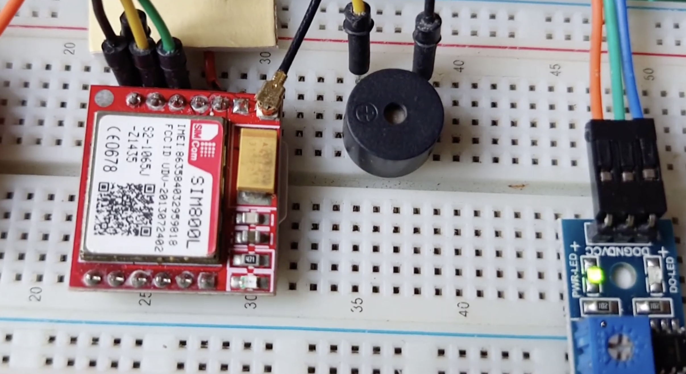

## Fire Detector and Moible SMS Alert System

# What is this?
A fire detector based on IR sensor and sends SMS alerts via GSM module. Using Arduino nano for processing.

# Why?
I have an IR sensor and arduino nano so I am trying out all doable projects with these. But otherwise also it is quite useful system to build it can be used as a DIY home fire detector sensor 

Components and BOM
| S.No. | Component Name        | Quantity | Unit Price (INR) | Total (INR) |
|------:|-----------------------|---------:|-----------------:|------------:|
| 1     | Arduino Nano          | 1        | ₹299             | ₹299        |
| 2     | SIM800L GSM Module    | 1        | ₹499             | ₹499        |
| 3     | Infrared Flame Sensor | 1        | ₹68              | ₹68         |
| 4     | Buzzer                | 1        | ₹178             | ₹178        |
| 5     | 18650 3.7V Battery    | 1        | ₹85              | ₹85         |
| 6     | Jumper Wires          | 15       | ₹198             | ₹198        |
| 7     | Breadboard            | 1        | ₹158             | ₹158        |
|       | **Grand Total**       |          |                  | **₹1,485**  |
