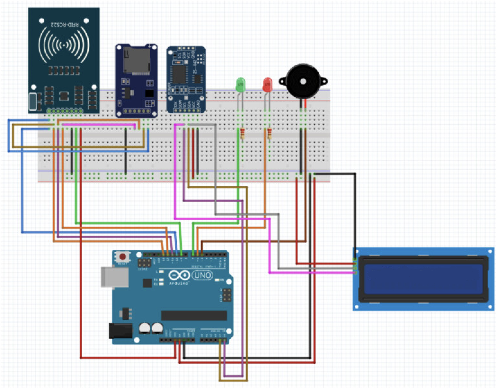

# RFID Smart Access Control System

What is this?

This is RFID based smart access control system using a Microcontroller.

The idea is that instead of using a normal key, a user can scan an RFID card or key tag. The Microcontroller checks if the card is registered and then unlocks the door if it is allowed.

The system also has a touchscreen, camera, buzzer and LEDs.

```text
RFID Card
    |
    v
RFID Reader
    |
    v
Microcontroller
    |
    v
Check Card
   / \
 YES  NO
  |    |
  v    v
Unlock Deny
Door   Access
```

Why did I make this?
Honestly I have holidays and want to make cool IoT stuff coz its fun. I wanted to learn RFID concepts and how it works so building this. RFID is used ine offices, hotels, attendance systems and access control systems, so I thought it would be cool to make my own small version.

I also wanted to use a Microcontroller because it gives me more options for adding things like a touchscreen, camera, and Wi-Fi later.

---

# Objectives

- Make an RFID based access control system.
- Allow registered RFID cards to unlock the door.
- Use Microcontroller as the main controller.
- Control an electronic door lock.
- Show information on a touchscreen.
- Give audio and LED feedback.
- Use a camera to monitor access.
- Store access attempts.
- Make the project expandable in the future.

---

# System Architecture


```text
                         RFID CARD
                             |
                             v
                     +---------------+
                     |  RFID Reader  |
                     |    MFRC522    |
                     +-------+-------+
                             |
                             v
                    +------------------+
                    |   Microcontroller   |
                    +--------+---------+
                             |
              +--------------+--------------+
              |              |              |
              v              v              v
        Touchscreen       Camera         Relay
              |              |              |
              |              |              v
              |              |        Door Lock
              |              |
              v              v
          Display         Monitoring

              |
              +---------> Buzzer
              |
              +---------> LEDs
```

---

# How it works

When an RFID card is scanned, the RFID reader reads its unique ID and sends it to the Microcontroller.

The Microcontroller checks the ID against the registered cards.

### Authorized Card

```text
RFID Card
    |
    v
RFID Reader
    |
    v
Microcontroller
    |
    v
Card Authorized
    |
    v
Relay ON
    |
    v
Door Unlocks
    |
    v
Green LED + Buzzer
```

### Unauthorized Card

```text
RFID Card
    |
    v
RFID Reader
    |
    v
Microcontroller
    |
    v
Card Not Authorized
    |
    v
Door Stays Locked
    |
    v
Red LED + Buzzer
```

---

# Components

## Microcontroller

The Microcontroller is the main controller of the project.

It handles the RFID reader, touchscreen, camera, LEDs, buzzer and door lock.

## RFID Reader

The RFID reader is used to read 13.56 MHz RFID cards and tags.

## RFID Cards and Key Tags

Each card or tag has a unique ID. The Microcontroller checks this ID to see if the user is allowed to enter.

## Electronic Door Lock

A 12V electronic solenoid lock is used to lock and unlock the door.

A relay is used between the Microcontroller and the lock.

## Touchscreen

The touchscreen can display messages such as:

```text
SMART ACCESS

Scan your card
```

or:

```text
ACCESS GRANTED

Door Unlocked
```

or:

```text
ACCESS DENIED

Card not registered
```

## Camera

The camera can be used to take a picture when someone tries to access the door.

---

# Alert System

### Access Granted

- Green LED
- Short buzzer sound
- Door unlocks

### Access Denied

- Red LED
- Warning buzzer
- Door stays locked

---


# Basic Workflow

```text
START
  |
  v
Initialize Microcontroler
  |
  v
Initialize RFID Reader
  |
  v
Initialize Display
  |
  v
Initialize Camera
  |
  v
Wait for RFID Card
  |
  v
Card Detected?
  |
  +---- NO ----> Keep Waiting
  |
 YES
  |
  v
Read Card ID
  |
  v
Check Card
  |
  +----------------------+
  |                      |
AUTHORIZED           NOT AUTHORIZED
  |                      |
  v                      v
Green LED             Red LED
  |                   Buzzer
  v                      |
Relay ON                 |
  |                      v
  v                 Door Stays Locked
Unlock Door
  |
  v
Log Access
  |
  v
Take Photo
  |
  v
Lock Door
  |
  v
Wait for Next Card
```


# Bill of Materials

| Sl. No. | Component | Specification | Qty | Unit Price | Total|
|---:|---|---|---:|---:|---:|
| 1 | [Arduino Uno ](amazon.in/permanent-guarantee-Arduino-Uno/dp/B0044X2E5S)| R3 | 1 | 3,200 | 3,200 |
| 2 | RFID Reader | MFRC522 13.56 MHz RFID Module | 2 | 150 | 300 |
| 3 | RFID Cards | 13.56 MHz RFID Cards | 10 | 40 | 400 |
| 4 | RFID Key Tags | 13.56 MHz RFID Key Tags | 5 | 30 | 150 |
| 5 | Electronic Door Lock | 12V Solenoid Lock | 1 | 1,000 | 1,000 |
| 6 | 12V Power Supply | 12V 5A Adapter | 1 | 700 | 700 |
| 7 | 3.5 inch Touchscreen Display | Touch Display for Microcontroller | 1 | 3,000 | 3,000 |
| 8 | Microcontroller Camera Module | Camera Module | 1 | 2,500 | 2,500 |
| 9 | Relay Module | 5V Relay Module | 1 | 150 | 150 |
| 10 | Buzzer | Active 5V Buzzer | 1 | 50 | 50 |
| 11 | LEDs | Red and Green High Brightness LEDs | 4 | 10 | 40 |
| 12 | Breadboard | Full Size Solderless Breadboard | 1 | 250 | 250 |
| 13 | Jumper Wire Kit | Male-Male, Male-Female, Female-Female | 1 | 350 | 350 |
| 14 | MicroSD Card | 64GB Class 10 | 1 | 700 | 700 |
| 15 | Enclosure | Electronics Project Enclosure | 1 | 800 | 800 |
| 16 | Mounting Hardware | Screws, Nuts, Standoffs and Brackets | 1 | 200 | 200 |
| 17 | USB Cable and Misc Wiring | Power and Data Cables | 1 | 250 | 250 |
| | | | | **Total** | **₹14,040** |

[View BOM.csv](./BOM.csv)
