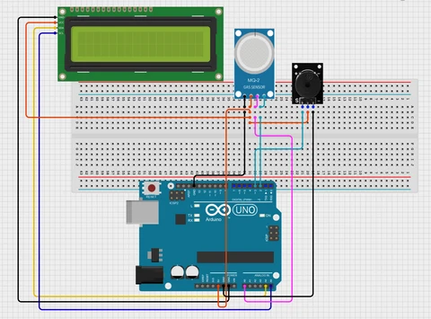

## Smoke and Fire Detector System

# What is this?

This is a smoke and fire detector system made using an Arduino Nano, a smoke sensor, a flame sensor and a buzzer.

The smoke sensor is used to detect smoke and the IR flame sensor is used to detect fire or a flame. If either sensor detects something, the Arduino turns on the buzzer to give a warning.

# Why?

I had an Arduino board, a smoke sensor and a flame sensor, so I wanted to make a project using them.

I thought a smoke and fire detector would be a useful project and honestly quite fun. It can be used as a simple DIY warning system for detecting smoke or fire.

This project also helped me understand how Arduino reads sensors and reacts to their values.

# How does it work?

The smoke sensor continuously checks for smoke in the air.

The flame sensor checks for infrared light coming from a flame.

The Arduino reads the values from both sensors. If smoke is detected or a flame is detected, the Arduino turns on the buzzer.

The basic working is:

Smoke detected → Arduino → Buzzer ON

Fire detected → Arduino → Buzzer ON

When there is no smoke or fire, the buzzer stays off.

# Components and BOM
[View BOM.csv](./bom.csv)

| S.No. | Component Name | Quantity | Unit Price (INR) | Total (INR) |
|------:|----------------|---------:|-----------------:|------------:|
| 1 | Arduino Nano | 1 | ₹299 | ₹299 |
| 2 | MQ-2 Smoke Sensor | 1 | ₹100 | ₹100 |
| 3 | IR Flame Sensor | 1 | ₹68 | ₹68 |
| 4 | Buzzer | 1 | ₹20 | ₹20 |
| 5 | LED | 1 | ₹5 | ₹5 |
| 6 | Jumper Wires | 15 | ₹10 | ₹10 |
| 7 | Breadboard | 1 | ₹100 | ₹100 |
| | **Grand Total** | | | ₹602 (10 USD) |

# Working

When the Arduino is turned on, it starts reading the smoke and flame sensors.

The MQ-2 gives an analog value based on the amount of smoke or gas detected. The Arduino compares this value with a threshold set in the code.

The flame sensor gives a digital signal when it detects a flame.

If the smoke value goes above the set limit or the flame sensor detects a flame, the Arduino turns on the buzzer and LED.

If there is no smoke or flame detected, the buzzer and LED stay off.
