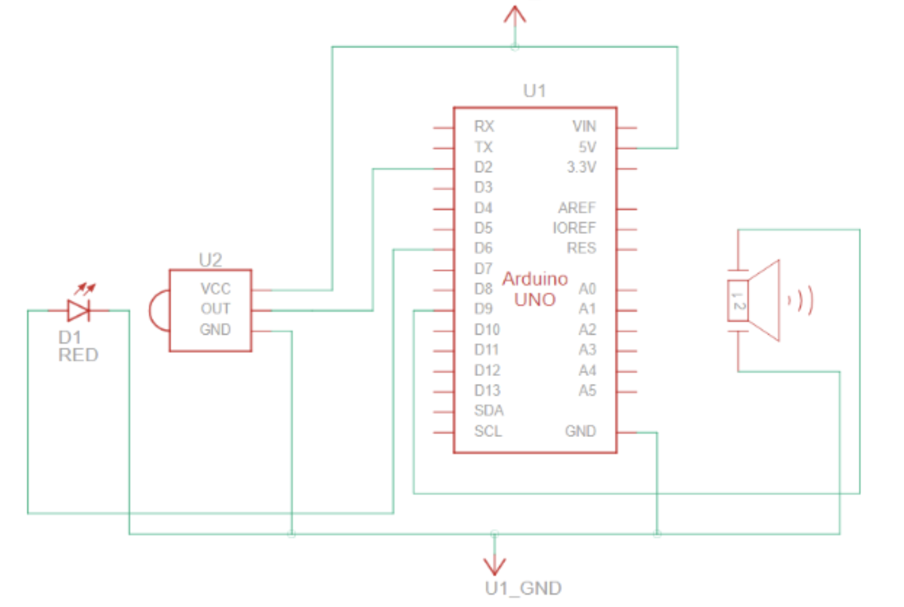
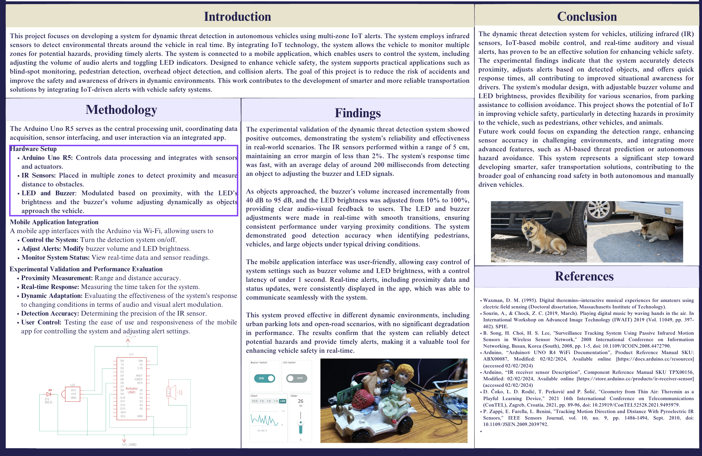

## Dynamic Threat Detection for Autonomous Vehicles Using Multi-Zone IoT Alerts

# What is this?
This project focuses on developing a system for dynamic threat detection in autonomous vehicles using multi-zone IoT alerts. The system employs infrared sensors to detect environmental threats around the vehicle in real time. By integrating IoT technology, the system allows the vehicle to monitor multiple zones for potential hazards, providing timely alerts. The system is connected to a mobile application, which enables users to control the system, including adjusting the volume of audio alerts and toggling LED indicators. Designed to enhance vehicle safety, the system supports practical applications such as blind-spot monitoring, pedestrian detection, overhead object detection, and collision alerts. The goal of this project is to reduce the risk of accidents and improve the safety and awareness of drivers in dynamic environments. This work is contributing to the development of smarter and more reliable transportation solutions by integrating IoT-driven alerts with vehicle safety systems.

# Components
The Arduino Uno R5 serves as the central processing unit, coordinating data acquisition, sensor interfacing, and user interaction via an integrated app.
Hardware Setup
Arduino Uno R5: Controls data processing and integrates with sensors and actuators.
IR Sensors: Placed in multiple zones to detect proximity and measure distance to obstacles.
LED and Buzzer: Modulated based on proximity, with the LED’s brightness and the buzzer’s volume adjusting dynamically as objects approach the vehicle.
Mobile Application Integration
A mobile app interfaces with the Arduino via Wi-Fi, allowing users to
Control the System: Turn the detection system on/off.
Adjust Alerts: Modify buzzer volume and LED brightness.
Monitor System Status: View real-time data and sensor readings.
Experimental Validation and Performance Evaluation
Proximity Measurement: Range and distance accuracy.
Real-time Response: Measuring the time taken for the system.
Dynamic Adaptation: Evaluating the effectiveness of the system's response to changing conditions in terms of audio and visual alert modulation.
Detection Accuracy: Determining the precision of the IR sensor.
User Control: Testing the ease of use and responsiveness of the mobile app for controlling the system and adjusting alert settings.

[View BOM.csv](./bom.csv)
| Sl. No. | Component | Specification | Qty | Unit Price (USD) | Total (USD) |
|---:|---|---|---:|---:|---:|
| 1 | Arduino UNO R4 WiFi | 32-bit RA4M1, Wi-Fi + Bluetooth | 1 | $90.54 | $90.54 |
| 2 | IR LED | 940 nm High Power | 2 | $0.53 | $1.06 |
| 3 | IR Sensor | High Sensitivity | 2 | $1.60 | $3.20 |
| 4 | 18650 Li-ion Battery | 3400 mAh | 1 | $6.40 | $6.40 |
| 5 | TP4056 Charging Module with Protection | USB-C | 1 | $2.13 | $2.13 |
| 6 | DC-DC Buck Converter | 3.3V/5V Adjustable | 1 | $2.66 | $2.66 |
| 7 | Active Piezo Buzzer | 5V | 1 | $1.60 | $1.60 |
| 8 | High Brightness LEDs | Red, Yellow, Green | 3 | $0.32 | $0.96 |
| 9 | Mini Speaker | 3W 4Ω | 1 | $5.32 | $5.32 |
| 10 | Breadboard | Full Size | 1 | $3.72 | $3.72 |
| 11 | Jumper Wire Kit | Premium Male-Male, Male-Female | 1 | $3.19 | $3.19 |
| 12 | Resistor Kit | Assorted | 1 | $2.13 | $2.13 |
| 13 | PCB, Headers & Connectors | JST, Berg Strips, Terminals | 1 | $6.38 | $6.38 |
| 14 | Mounting Hardware | Screws, Nuts, Standoffs, Heat Shrink | 1 | $5.32 | $5.32 |
| 15 | USB-C Cable & Misc. Wiring | High Quality | 1 | $5.32 | $5.32 |
| | **Total** | | | | **$140.00** |

