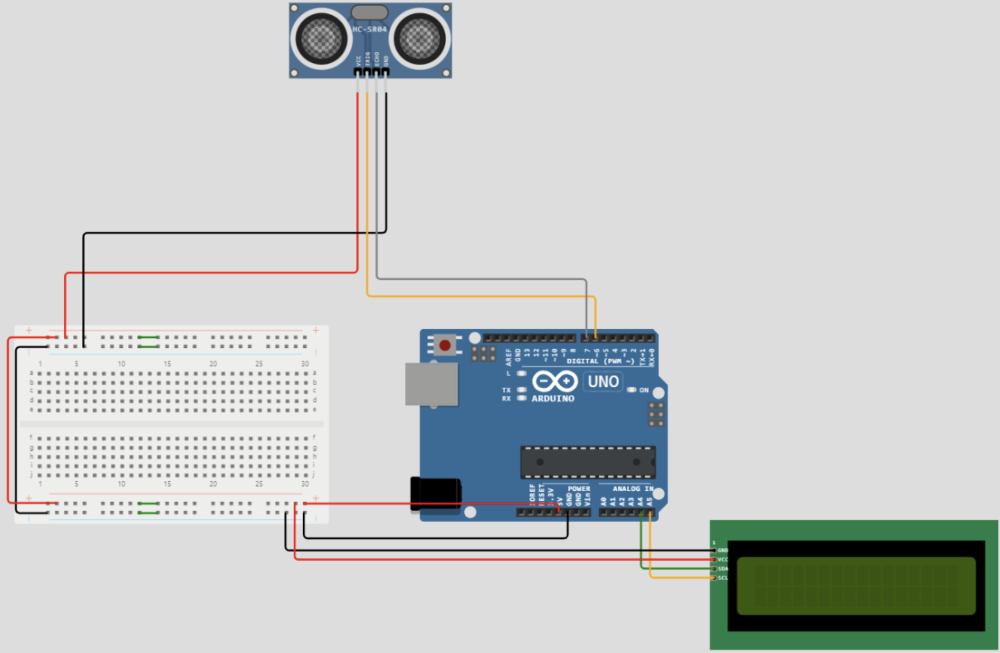
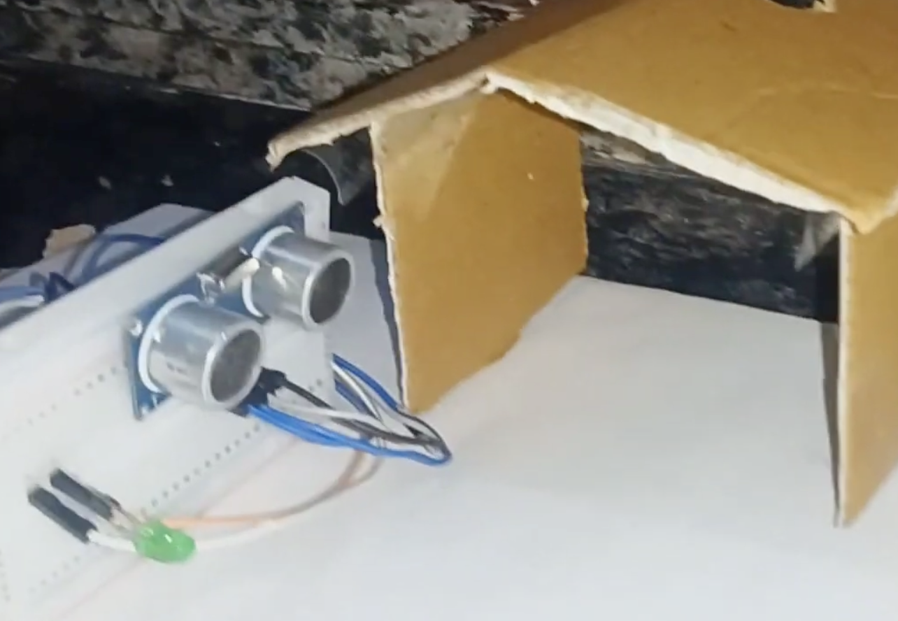

# Ultra Sound People Counter and Automatic Lighting System

# What is this?
It is a People Counter using Arduino UNO and an HC-SR04 Ultrasonic Sensor. Whenever a person passes in front of the sensor, the Arduino detects the movement, increases the count, and turns on an LED as an indication. Could use this counting people entering a house or room or can also be used in bus or vehicles. it displays the number of count on your device. Because this sensing is using ultrasound sensor by connecting an Led we can even make automatic light system which turns on when there are people and turns off when there are none

# Why Did I make this?
Honestly, I have purchased aurdino board and other iot kits so I am trying to play around with this as much as I can during my holidays. This project is using bluetooth for displahying the count of personal devices.
# Components
    1. Arduino UNO
    2. HC-SR04 Ultrasonic Sensor
    3. LED
    4. 220Ω Resistor
    5. Breadboard
    6. Jumper Wires

# Circuit Diagram

# Bill of Materials

The complete BOM is also available here:

[View BOM.csv](./bom.csv)

| Sl. No. | Component | Specification | Qty | Unit Price | Total |
|---:|---|---|---:|---:|---:|
| 1 | Arduino UNO | ATmega328P Development Board | 1 | 1550 | 1550 |
| 2 | HC-SR04 Ultrasonic Sensor | Ultrasonic Distance Sensor | 1 | 80 | 80 |
| 3 | LED | 5mm LED | 1 | 5 | 5 |
| 4 | 220Ω Resistor | 220 Ohm Resistor | 1 | 2 | 2 |
| 5 | Breadboard | Full Size Solderless Breadboard | 1 | 150 | 150 |
| 6 | Jumper Wires | Male-Male Dupont Wires | 1 | 100 | 100 |
| | | | | **Total** | **₹1887** |

# LiquidCrystal_I2C Library
    1 Need to install the LiquidCrystal_I2C library. To install the library these are the steps:
    2 Go to the "Sketch" menu in arduino IDE, select "Include Library", then "Manage Libraries".
    I3 n the "Library Manager" window, search for "LiquidCrystal_I2C" and select "LiquidCrystal 12C by Frank de Brabander" from the results.
    4 Click the "Install" button to install the library.
