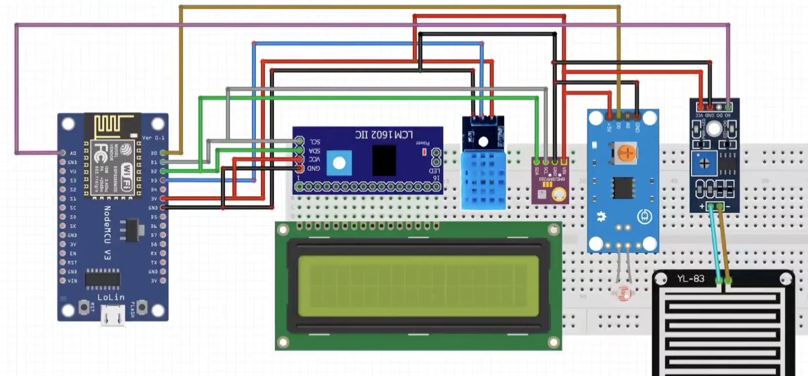
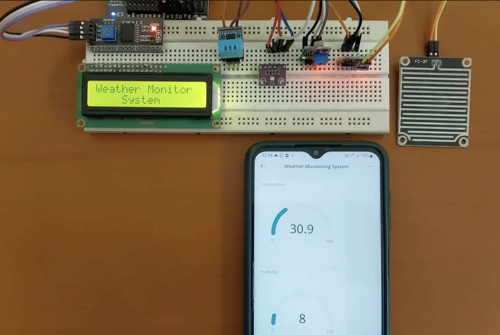

# Weather Monitoring System

# What is this?
It is a weather detection/monitoring system, has a lot of sensors for complete weather report, DHT11, BMP280, LDR, and Rain Sensor to track temperature, humidity, pressure, light intensity, and rainfall levels. 

# Why Did I make this?
Honestly, I have purchased aurdino board and other iot kits so I am trying to play around with this as much as I can during my holidays. This is one of the projects on ardunio websites so I did study that and refered it dor connecting the ardino cloud app.

# Components
    1. ESP8266 Board: Wifi
    2. Arduino IoT Cloud: Mobile App, dont need to build anything else just download the mobile app from playstore and create project on their website
    3. DHT11 Sensor: Measures temperature and humidity
    4. BMP280 Sensor: Monitors atmospheric pressure
    5. LDR Sensor: Tracks light intensity to gauge day and night cycles.
    6. Rain Sensor: Detects rainfall and precipitation levels
    7. NodeMCU and NodeMCU Breakout boards: processing boards

# Circuit Diagram



[View BOM.csv](./bom.csv)
Sl. No.,Component,Specification,Qty,Unit Price (₹),Total (₹),Type
1,NodeMCU ESP8266 Development Board,ESP8266 Wi-Fi Development Board,1,350,350,Hardware
2,NodeMCU Breakout Board,ESP8266 NodeMCU Expansion Board,1,150,150,Hardware
3,DHT11 Sensor,Temperature and Humidity Sensor,1,100,100,Sensor
4,BMP280 Sensor,Barometric Pressure Sensor,1,150,150,Sensor
5,LDR Sensor Module,Light Intensity Sensor,1,50,50,Sensor
6,Rain Sensor Module,Rain Detection Sensor with Module,1,80,80,Sensor
7,Breadboard,Full Size Solderless Breadboard,1,150,150,Hardware
8,Jumper Wires Male-Male,DuPont Wires,1,100,100,Wiring
9,Jumper Wires Male-Female,DuPont Wires,1,100,100,Wiring
10,Jumper Wires Female-Female,DuPont Wires,1,100,100,Wiring
11,Resistor Kit,Assorted Resistors,1,100,100,Component
12,USB Cable,Micro USB Cable for NodeMCU,1,100,100,Cable
13,5V Power Supply,USB 5V Power Adapter,1,200,200,Power
14,Terminal Blocks and Connectors,Basic Screw Terminals and Connectors,1,100,100,Hardware
15,Arduino IoT Cloud,Cloud Dashboard and Mobile App,1,0,0,Software
16,USB Cable and Misc Wiring,Extra Wires and Connections,1,100,100,Miscellaneous
,,,,Total,1880,

# Connecting it to Arduino IoT Cloud
One of the main reasons I used Arduino IoT Cloud is because I didn't want to make my own mobile app and backend just for this project. Arduino already has an app for this and quite easy to use altho connecting takes time and you cant resent the password if you forget it then the board sort of becomes unusable.

Download the Arduino App from playstore and login. You can use it on mobile you cant really edit or add a lot through phone but can do everything needed on the browser, can customize and use a lot of widgets.

The basic flow is:

```text
Sensors
   |
   v
NodeMCU ESP8266
   |
   | Wi-Fi
   v
Arduino IoT Cloud
   |
   v
Arduino IoT Remote App
   |
   v
My Phone

Reference guide - https://projecthub.arduino.cc/dbeamonte_arduino/weather-station-with-arduino-cloud-20ce95
